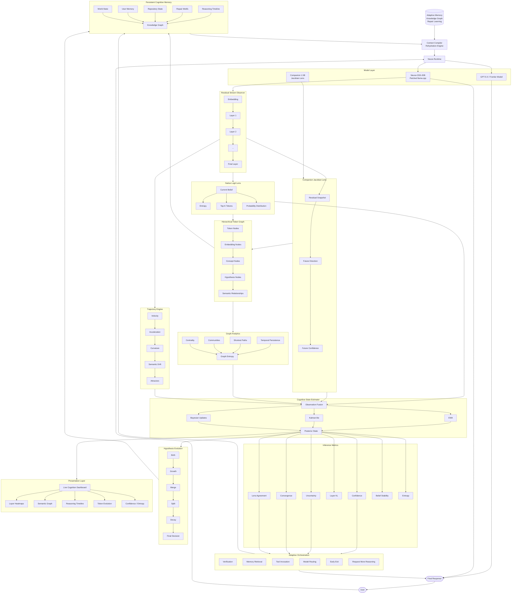

## NEURA
> Policy driven AI middleware and agent system with deterministic routing structured tool orchestration SPO based fact extraction crosssource conflict detection agreement scoring bounded reconciliation loops memory guided strategy bias and execution aware planning transforming LLM outputs into a controlled self correcting verifiable reasoning and decision engine across dynamic real world tasks

`user query` **→** `policy decision engine` **→** `tool routing` **→** `multi-source orchestration` **→** `structured extraction (SPO + numerics + entities)` **→** `conflict detection (numeric + semantic)` **→** `evaluation + reconciliation controller` **→** `memory guided synthesis` **→** `final answer`


# [PAPER.md](https://github.com/neura-asi/.github/blob/main/profile/PAPER.md)


```  The architecture, mapped to concrete components

  gpt-oss-20b (patched llama-server, n-cpu-moe)   companion 1.5B (jlens, PyTorch)
          │ residual @ layer L (real)                    │ residual @ layer L
          ▼                                              ▼
    in-engine LOGIT LENS  ──────────┐         JACOBIAN LENS (future dir)
    (current belief, entropy)       │                    │
                                    ▼                    ▼
                          ┌──────  STATE ESTIMATOR (cogstate.py)  ──────┐
                          │  EMA/Kalman-lite smoothing over layers      │
                          └──────────────────┬──────────────────────────┘
                                             ▼
                              TRAJECTORY ANALYSIS
               entropy · layer-agreement(KL) · convergence · hypothesis tracks ·
                          current-vs-future divergence (uncertainty)
                                             ▼
                LIVE UI (dashboard)      +      ADAPTIVE ORCHESTRATION
          token-by-token cognition panel     (soft triggers: verify / retrieve /
                                              tool / early-stop — opt-in, gated)

```

# Runtime

Unlike traditional agent architectures that treat the language model as a black box, Neura continuously observes, estimates, and reasons about the model's evolving cognitive state.


